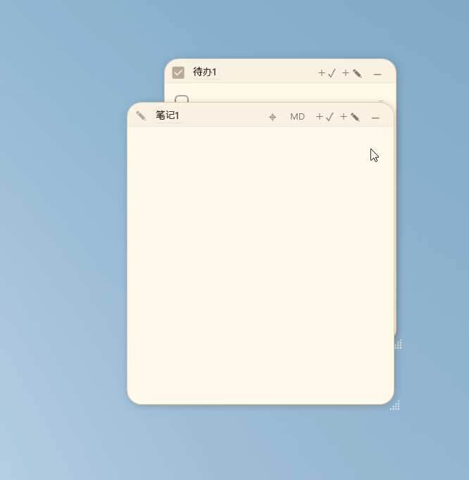

<p align="center"></p>
<h1 align="center">PaperNook · 纸隅</h1>

<p align="center">
  <strong>Let a few quiet, useful, unobtrusive sheets of paper live on your desktop.</strong><br>
  A lightweight, openly co-created Windows desktop sticky-note app.
</p>

> Maintained by [weidaodeyinghuaji](https://github.com/weidaodeyinghuaji). Feedback: `3090444537@qq.com`. PaperNook is based on [PaperTodo](https://github.com/snownico0722/PaperTodo); the original copyright notice and full license terms remain in [LICENSE.md](LICENSE.md).

<p align="center">
  
  
  
  
</p>

<p align="center">
  <strong>Language: English | <a href="README.zh.md">简体中文</a></strong><br>
  <a href="https://github.com/weidaodeyinghuaji/PaperNook">Official Website</a><br>
  <a href="doc/USER_GUIDE.en.md">User Manual</a> · <a href="CHANGELOG.md">Changelog</a>
</p>

---

## Preview

| Papers |
| :---: |
|  |

| Markdown View |
| :---: |
|  |

| Capsule Mode | Advanced Capsules |
| :---: | :---: |
|  |  |
| Papers can collapse into compact capsules to reduce desktop clutter. | Collapsed capsules automatically dock to screen edges and slide out on hover. |

---

## Philosophy

- **Paper first** — Every paper is an independent window that lives directly on the desktop, with no layered management console to open first.
- **Ready immediately** — Write when you want, check things off when done; everything saves automatically and the interaction path stays short.
- **No unnecessary management** — PaperNook deliberately avoids complex project-management models, reducing the mental overhead of everyday capture.
- **Native & lightweight** — Built natively with WPF, without a Web wrapper, for fast startup and low resource use.
- **Restrained interaction** — The UI stays clean and low-distraction: quiet when idle, immediately available when needed.
> No unnecessary interaction layers. No unnecessary visual focus.

---

## Core Features

### 1. Two Basic Paper Types
- **Todo Paper**: A clean, efficient checklist with drag-and-drop ordering, continuous swipe multi-selection, and smart splitting of multi-line paste; completed items can be cleared automatically or moved to the bottom.
- **Note Paper**: Lightweight Markdown and visual notes with three levels of real-time rendering, natural editing/reading flow, and support for pasting or dropping local images.

### 2. Edge Capsules & Live Preview Cards
- **Collapse & Dock**: Click the top-right button or press `Ctrl+W` to collapse a paper into a compact capsule that automatically docks to a screen edge and frees up desktop space.
- **Hover Preview Cards (Preview)**: Hover an edge capsule to smoothly open a lightweight interactive preview card and inspect content without opening the full paper window:
  - **Todo Preview**: Scroll, check, or uncheck visible tasks directly in the hover card; click the card background to open the full paper.
  - **Note Preview**: Instantly renders Markdown body layout and image placeholders.
  - **Intent Prediction & Seamless Handoff**: Built-in pointer-intent prediction keeps transitions smooth while moving across adjacent capsules and retracts automatically when the pointer leaves.
- **Multi-Monitor Flow & Master Capsule**: Drag capsules across displays and edges; the master capsule at the top can collapse the whole queue and can be dragged to adjust the queue's starting height.

### 3. New Plugin System (Preview)
- **Desktop Micro-App Expansion**: Papers are not limited to notes—you can switch them into clocks, focus Pomodoro timers, review pools, and other rich plugins: a next-generation take on Windows desktop widgets.
- **Deep Capsule & Top-Bar Integration**: Plugins can collapse into dedicated capsules, provide edge-hover cards and custom top-bar actions, while keeping their data stored independently.
- **Drop-in Use**: Place a plugin folder in `plugins/` and PaperNook can recognize it directly. To build your own plugin, see the [Plugin Development Manual](plugin-samples/README.md).

### 4. Ultra-Smooth Native Experience & High-Refresh Tuning
- **Full high-refresh optimization**: Paper folding/unfolding, edge drawer motion, card handoff, and cross-monitor dragging are deeply tuned for frame pacing, with full support for 120Hz/144Hz/165Hz+ displays for a smooth, stutter-free feel.
- **Pure native responsiveness**: Built with .NET 10 and native WPF without Web-wrapper overhead, aiming for millisecond-level interaction, very low memory/CPU use, and unobtrusive always-on operation.
- **Incremental rendering for long notes**: Note input uses localized incremental parsing so long text-and-image notes remain responsive and IME input stays smooth.
- **Smooth multi-monitor and mixed-DPI flow**: Deeply adapted for multi-display setups with different scaling factors, keeping cross-screen dragging and edge docking precise without flicker or distortion.

### 5. Universal Todo Linking & Script Capsules
- **Quick Launch & Universal Linking**: Drag the link icon from another paper's top bar, or drop a file/folder from File Explorer onto a todo item, then click it to jump straight to the target.
- **Script Capsules (PowerShell)**: Put `!p` or `!power` on the first line of a note to turn it into a script runner; when collapsed it becomes a lightning capsule that executes the script when clicked.

### 6. Advanced Labs Features (Preview)
- **Local MCP Interface**: Start PaperNook with `--mcp` to expose a standard MCP service, allowing authorized external AI assistants such as Claude or Cursor to securely read, write, and manage todos and notes.
- **Third-Party Window Tethering**: Drag to attach a paper to any third-party app window so it follows that window smoothly as it moves, minimizes, and restores.
- **Scheduled Reminders**: Todo items support custom countdown reminders with tray notifications and alert sounds when due.
- **Idle Behavior & Desktop Integration**: Papers can auto-collapse into capsules on focus loss and compact their title bar while idle; global shortcuts can send papers behind other windows and enable mouse click-through for deeper desktop integration.

### 7. Customization & Data Ownership
- **Appearance Customization**: Follow system/light/dark themes, choose from Warm Paper, Ink, Forest, and Rosy palettes, use a custom font by placing `papertodo.ttf`, and switch between multiple UI languages.
- **Local Control**: Data and images stay in the application directory (`data.json` and `note-assets.lmdb`), with automatic snapshot backups before writes and full offline operation.

---

## Common Operations & Shortcuts

| Action | Shortcut / Trigger | Description |
| :--- | :--- | :--- |
| **Collapse / Hide Paper** | <kbd>Ctrl</kbd> + <kbd>W</kbd> or middle-click the top bar | Collapses into a capsule when enabled; otherwise hides the paper |
| **Cancel / Retract** | <kbd>Esc</kbd> | Cancels multi-selection/drag; collapses the current paper when no other interaction is active |
| **Undo / Redo** | <kbd>Ctrl</kbd> + <kbd>Z</kbd> / <kbd>Ctrl</kbd> + <kbd>Y</kbd> | Available in both Todo and Note, with up to 100 history steps |
| **Note Formatting** | <kbd>Ctrl</kbd> + <kbd>B</kbd> / <kbd>I</kbd> / <kbd>K</kbd> | Bold, italic, insert link |
| **Note Font Zoom** | <kbd>Ctrl</kbd> + Scroll Wheel | Zoom note text; click the percentage at bottom-right to reset |
| **Retrieve All Papers** | Double-click tray icon | Highlights and pulls all papers back into view, useful after monitor disconnects or window drift |

---

## Download & Run

PaperNook is a portable single-file application and requires no installation. Download the version you need from [Releases](https://github.com/weidaodeyinghuaji/PaperNook/releases/latest):

- **`PaperNook-...-self-contained.exe` (Recommended)**: Includes the .NET runtime and can be launched directly after download.
- **`PaperNook-...-no-runtime.exe`**: Smaller download for systems that already have .NET 10 Desktop Runtime (x64) installed.

> **Tip**: Keep the executable in a dedicated writable directory such as `D:\Apps\PaperNook\`. Avoid read-only locations or temporary extraction folders. Place `PaperNook.ico` in the application directory to use it as a custom tray icon.

Starting with PaperNook V1.0, official release assets carry an Authenticode signature and verification manifest. Settings → Backup & updates provides trusted updates, verifiable backups, and rollback restore. The portable ZIP includes `papernook.portable` and keeps content under `Data`, `Notes`, `Cache`, and `Backups`, ready to use after extraction.

On first launch, papers appear on the desktop and the PaperNook tray icon remains available. If papers are covered or moved off-screen, **double-click the tray icon** to show and retrieve all papers.

---

## Documentation & Advanced Guides

- 📖 **[Full User Manual](doc/USER_GUIDE.en.md)**: Includes a three-minute getting-started guide, advanced Todo/Note usage, multi-monitor capsule management, the full settings reference, script rules, device-migration guidance, and FAQ.
- 🧩 **[Plugin Development Manual](plugin-samples/README.md)**: Learn the PaperNook paper-body plugin extension model, protocol details, and example index.
- 📋 **[Changelog](CHANGELOG.md)**: Review release changes and fixes.

---

## Build & Dependencies

Local builds require Windows and the .NET 10 SDK:

```powershell
git clone --recurse-submodules https://github.com/weidaodeyinghuaji/PaperNook.git
cd PaperNook
dotnet build -c Release
```

If you cloned without submodules, initialize them first:

```powershell
git submodule update --init --recursive
dotnet build -c Release
```

---

## Feedback & Community

- Bugs & suggestions: [GitHub Issues](https://github.com/weidaodeyinghuaji/PaperNook/issues)

Thanks to the [linux.do](https://linux.do/) community for the support.

---

<!-- BEGIN GENERATED CHINESE README -->
<details>
<summary>简体中文（点击展开完整 README）</summary>

<h1 align="center">PaperNook · 一张纸</h1>

<p align="center">
  <strong>让桌面上有几张安静、可用、不打扰人的纸。</strong><br>
  一个轻量、自由共创的 Windows 桌面便签。
</p>

<p align="center">
  
  
  
  
</p>
<p align="center">
  <strong>语言：简体中文 | <a href="README.md">English</a></strong><br>
  <a href="https://github.com/weidaodeyinghuaji/PaperNook">官方网站</a> <br>
  <a href="doc/USER_GUIDE.md">用户手册</a> · <a href="CHANGELOG.zh.md">更新日志</a><br>
  反馈邮箱：<a href="mailto:3090444537@qq.com">3090444537@qq.com</a>
</p>

---

## 预览

| 纸片 |
| :---: |
|  |

| Markdown 浏览 |
| :---: |
|  |

| 胶囊模式 | 高级胶囊 |
| :---: | :---: |
|  |  |
| 纸片可折叠为小胶囊，减少桌面占用。 | 折叠胶囊自动贴到屏幕边缘，悬浮时滑出。 |

---

## 设计理念

- **纸片优先** — 每张纸都是独立窗口，直接常驻桌面，无需打开层级复杂的管理后台。
- **即时使用** — 想记就写，勾选即完；所有内容自动保存，操作路径极短。
- **无需管理** — 不刻意承载复杂的项目管理逻辑，降低日常记录的心智负担。
- **原生轻量** — 基于 WPF 原生开发，拒绝 Web 套壳，启动快速且资源占用低。
- **交互克制** — 界面干净低干扰，该安静时安静，需要时随时呼出。
> 拒绝长出非必要的交互层级和视觉焦点负担。

---

## 核心特性

### 1. 两种基础纸片
- **待办纸（Todo）**：清爽高效的任务清单。支持拖拽排序、连续滑动多选、多行粘贴智能拆分；已完成项支持自动清除或置底。
- **笔记纸（Note）**：轻量 Markdown 与图文备忘。支持常用 Markdown 语法与三档实时渲染，编辑与浏览自然融合；支持粘贴或拖入本地图片。

### 2. 边缘胶囊与实时预览卡片
- **折叠贴边**：点击右上角或按 `Ctrl+W` 将纸片折叠为小胶囊，自动靠在屏幕边缘，彻底释放桌面空间。
- **悬停预览卡片（Preview）**：鼠标悬停在边缘胶囊上，即可平滑展开轻量、可交互的预览卡片，无需打开完整大窗口即可即时速览：
  - **待办预览**：直接在悬停卡片上滚动查看、勾选完成或撤销，点击卡片背景呼出完整纸片；
  - **笔记预览**：即时渲染 Markdown 正文排版与图片占位；
  - **意图预测与顺滑接续**：内置鼠标移动意图预测，在相邻胶囊间连续滑动时平滑过渡切换，离开后自动收回。
- **多屏流动与主胶囊**：支持多显示器拖拽换边；顶部主胶囊可一键收拢整列入口，拖动可调节队列起始高度。

### 3. 全新插件系统（Preview）
- **桌面微应用扩展**：便签不仅能记笔记，还可一键切换为时钟、专注番茄钟、复盘池等丰富插件，下一代的windows桌面小组件。
- **深度融入胶囊与顶栏**：插件同样支持折叠为专属胶囊、边缘悬停卡片与专属顶栏按钮，且数据独立安全保存。
- **即放即用**：将插件文件夹放入 `plugins/` 目录即可直接识别。如需自行开发插件，可查阅 [插件开发手册](plugin-samples/README.zh.md)。

### 4. 极致流畅与全链路高刷调优
- **全面适配高刷新率**：无论是纸片折叠展开、边缘抽屉滑出、卡片顺滑接续还是跨屏拖拽，全链路动效均经过深度帧率调优，完美适配 120Hz/144Hz/165Hz+ 高刷屏，细腻丝滑、完全不掉帧。
- **纯原生极速响应**：基于 .NET 10 与 WPF 原生构建，拒绝任何 Web 套壳的性能开销，毫秒级即点即开，内存与 CPU 占用极低，常驻后台毫无负担。
- **长笔记增量渲染**：笔记输入采用智能局部增量解析，面对长篇图文依然流畅跟手，彻底杜绝输入法卡顿。
- **多屏与混合 DPI 顺畅流转**：深度适配多显示器与不同缩放比例环境，跨屏拖拽与边缘停靠计算精确，不闪烁、不形变。

### 5. 待办万物互联与脚本胶囊
- **快速启动与万物关联**：从另一张纸片顶栏拖出关联图标，或直接从文件管理器拖入文件/文件夹至待办项，点击即可一键直达。
- **脚本胶囊（PowerShell）**：笔记首行写入 `!p` 或 `!power`，便签即可化身脚本运行器；折叠后显示闪电胶囊，点击直接执行脚本命令。

### 6. 实验室深度能力（Preview）
- **本地 MCP 接口**：支持通过 `--mcp` 模式启动标准 MCP 服务，允许外部 AI 助手（如 Claude、Cursor 等）按授权安全读写与管理待办和笔录。
- **第三方窗口绑定**：可拖拽绑定至任意第三方软件窗口，随目标窗口一同平滑移动、最小化与还原。
- **定时提醒**：待办支持设置自定义倒计时提醒（到期托盘通知与提示音）。
- **静置与桌面融入**：支持失焦自动收起为胶囊、静置收拢标题栏；支持快捷键一键置底并开启鼠标穿透，彻底融入桌面壁纸。

### 7. 个性化与数据安全
- **外观定制**：跟随系统/浅色/深色主题，内置暖纸、墨、林、霞四套配色；支持自定义字体（放置 `papertodo.ttf` 即可生效）与多语言界面。
- **本地自主可控**：数据与图片完整存放在程序所在目录（`data.json` 与 `note-assets.lmdb`），写盘前自动快照备份，完全离线运行。

---

## 常用操作与快捷键速查

| 操作 | 快捷键 / 触发方式 | 说明 |
| :--- | :--- | :--- |
| **折叠 / 隐藏纸片** | <kbd>Ctrl</kbd> + <kbd>W</kbd> 或顶栏中键 | 启用胶囊时折叠为胶囊，未启用时隐藏 |
| **取消交互 / 收起** | <kbd>Esc</kbd> | 取消多选/拖拽；无状态时折叠当前纸片 |
| **撤销 / 重做** | <kbd>Ctrl</kbd> + <kbd>Z</kbd> / <kbd>Ctrl</kbd> + <kbd>Y</kbd> | 待办与笔记通用（支持深达 100 步记录） |
| **笔记文本格式** | <kbd>Ctrl</kbd> + <kbd>B</kbd> / <kbd>I</kbd> / <kbd>K</kbd> | 对应加粗、斜体、插入链接 |
| **笔记字号缩放** | <kbd>Ctrl</kbd> + 滚轮 | 缩放正文字号（右下角点击百分比一键复位） |
| **找回全部纸片** | 双击托盘图标 | 显亮并拉回全部纸片（多屏断开或窗口漂移时瞬间召回） |

---

## 下载与运行

PaperNook 为绿色单文件程序，无需安装。请在 [Releases 页面](https://github.com/weidaodeyinghuaji/PaperNook/releases/latest) 下载对应版本：

- **`PaperNook-...-self-contained.exe`（推荐）**：已内嵌 .NET 运行时，下载后双击即可直接运行。
- **`PaperNook-...-no-runtime.exe`**：体积更小，适用于电脑已安装 .NET 10 Desktop Runtime (x64) 的环境。

> **提示**：建议将程序存放在有写入权限的专用目录（如 `D:\Apps\PaperNook\`），请勿存放在只读目录或临时解压目录中。程序目录下放置 `PaperNook.ico` 可作为自定义托盘图标。

首次运行后，纸片会出现在桌面上，托盘区会常驻 PaperNook 图标。若纸片被遮挡或移出屏幕，**双击托盘图标**即可显示并拉回所有纸片。

---

## 详细文档与进阶

- 📖 **[完整用户手册](doc/USER_GUIDE.md)**：包含新手 3 分钟入门指南、待办/笔记深度用法、多屏胶囊调度、全量设置项大字典、脚本编写规则、换机数据迁移教程及常见问题解答（FAQ）。
- 🧩 **[插件开发手册](plugin-samples/README.zh.md)**：了解 PaperNook 正文插件扩展机制、协议说明与示例索引。
- 📋 **[版本更新日志](CHANGELOG.zh.md)**：查阅更新与修复记录。

---

## 构建与依赖

本地编译需 Windows 环境并安装 .NET 10 SDK：

```powershell
git clone --recurse-submodules https://github.com/weidaodeyinghuaji/PaperNook.git
cd PaperNook
dotnet build -c Release
```

如克隆时未拉取子模块，请先执行：

```powershell
git submodule update --init --recursive
dotnet build -c Release
```


---

## 反馈与交流

- 提交 Bug 或建议：[GitHub Issues](https://github.com/weidaodeyinghuaji/PaperNook/issues)
- 反馈邮箱：3090444537@qq.com

感谢 [linux.do](https://linux.do/) 社区的支持。

</details>
<!-- END GENERATED CHINESE README -->
