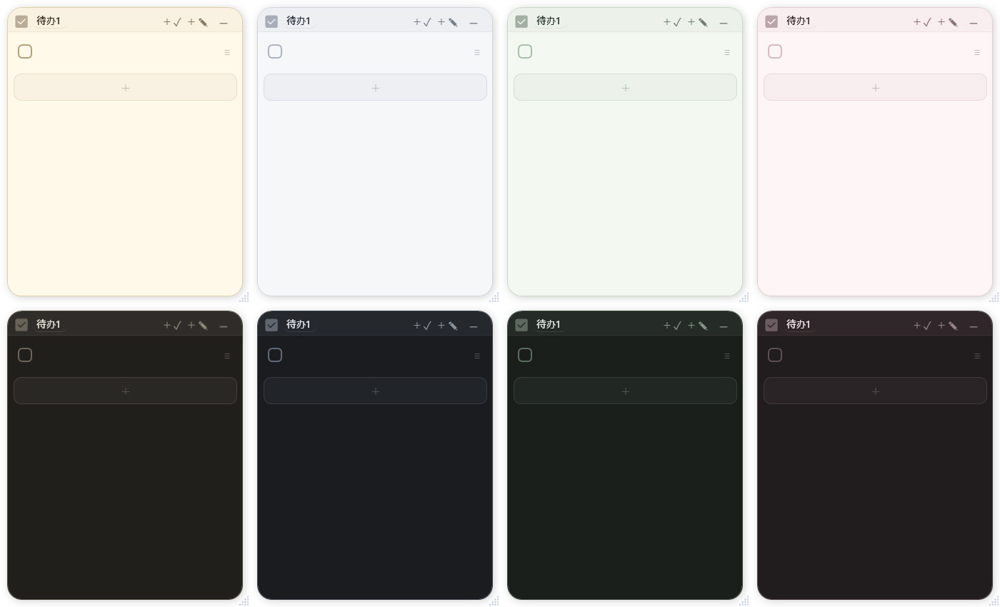
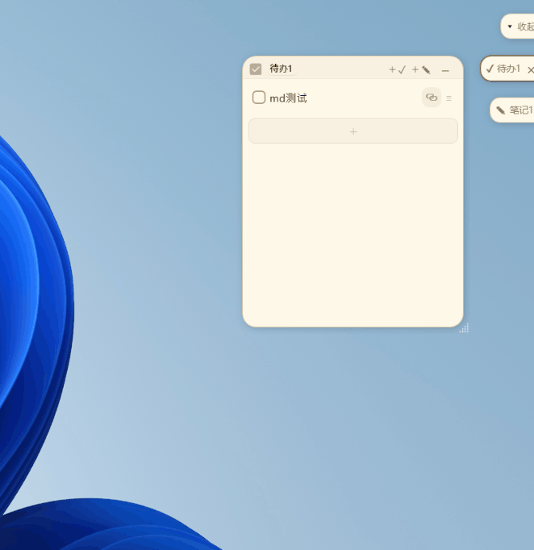

# PaperNook 用户手册

> **相关链接**：[返回项目主页](../README.zh.md) · [插件开发文档](../plugin-samples/README.md) · [版本更新日志](../CHANGELOG.zh.md)

本文档面向 PaperNook 的日常使用者。如果你是第一次接触 PaperNook，请先阅读 [1. 快速入门](#1-快速入门)；其余章节可在需要时按目录检索查阅。

---

## 目录

- [1. 快速入门](#1-快速入门)
  - [1.1 安装与版本选择](#11-安装与版本选择)
  - [1.2 首次启动与界面理念](#12-首次启动与界面理念)
  - [1.3 三分钟上手第一张纸](#13-三分钟上手第一张纸)
- [2. 纸片通用操作](#2-纸片通用操作)
  - [2.1 纸片形态：展开与胶囊](#21-纸片形态展开与胶囊)
  - [2.2 顶栏交互功能](#22-顶栏交互功能)
  - [2.3 移动、缩放与 Windows 分屏贴靠](#23-移动缩放与-windows-分屏贴靠)
  - [2.4 概念辨析：折叠、隐藏、删除与退出](#24-概念辨析折叠隐藏删除与退出)
- [3. 待办纸（Todo）完全指南](#3-待办纸todo完全指南)
  - [3.1 添加与编辑事项](#31-添加与编辑事项)
  - [3.2 排序、删除与批量处理](#32-排序删除与批量处理)
  - [3.3 完成项整理机制](#33-完成项整理机制)
  - [3.4 快速启动：关联纸片与本地文件](#34-快速启动关联纸片与本地文件)
  - [3.5 定时倒计时提醒](#35-定时倒计时提醒)
- [4. 笔记纸（Note）完全指南](#4-笔记纸note完全指南)
  - [4.1 编辑态与浏览态](#41-编辑态与浏览态)
  - [4.2 Markdown 语法支持一览](#42-markdown-语法支持一览)
  - [4.3 本地图片插入与管理](#43-本地图片插入与管理)
  - [4.4 外部编辑器临时打开](#44-外部编辑器临时打开)
- [5. 边缘胶囊与实时预览卡片（Edge Preview）](#5-边缘胶囊与实时预览卡片edge-preview)
  - [5.1 边缘胶囊与自动停靠](#51-边缘胶囊与自动停靠)
  - [5.2 实时悬停预览卡片（可交互）](#52-实时悬停预览卡片可交互)
  - [5.3 多显示器换边与队列排序](#53-多显示器换边与队列排序)
  - [5.4 主胶囊（队列控制器）](#54-主胶囊队列控制器)
- [6. 进阶玩法：脚本胶囊（PowerShell）](#6-进阶玩法脚本胶囊powershell)
  - [6.1 脚本胶囊声明语法](#61-脚本胶囊声明语法)
  - [6.2 触发运行与常驻进程](#62-触发运行与常驻进程)
  - [6.3 安全须知](#63-安全须知)
- [7. 快捷键完全速查表](#7-快捷键完全速查表)
  - [7.1 纸片内置快捷键](#71-纸片内置快捷键)
  - [7.2 全局快捷键](#72-全局快捷键)
  - [7.3 侧边胶囊快速启动（1~9）](#73-侧边胶囊快速启动19)
- [8. 设置项全景说明](#8-设置项全景说明)
  - [8.1 基础行为](#81-基础行为)
  - [8.2 视觉外观（含自定义字体）](#82-视觉外观含自定义字体)
  - [8.3 快捷键设置](#83-快捷键设置)
  - [8.4 插件系统使用指南（协议 2.1）](#84-插件系统使用指南协议-21)
  - [8.5 实验室功能（4.0 深度进阶）](#85-实验室功能40-深度进阶)
- [9. 托盘菜单与命令行启动参数](#9-托盘菜单与命令行启动参数)
  - [9.1 托盘菜单详解](#91-托盘菜单详解)
  - [9.2 命令行启动参数（CLI）](#92-命令行启动参数cli)
- [10. 数据备份、迁移与恢复](#10-数据备份迁移与恢复)
  - [10.1 目录结构与数据文件说明](#101-目录结构与数据文件说明)
  - [10.2 数据备份流程](#102-数据备份流程)
  - [10.3 跨电脑迁移与异常恢复](#103-跨电脑迁移与异常恢复)
  - [10.4 V1.0 可验证备份与安全恢复](#104-v10-可验证备份与安全恢复)
- [11. 常见问题解答（FAQ）](#11-常见问题解答faq)

---

## 1. 快速入门

### 1.1 安装与版本选择

PaperNook 是绿色单文件软件，不需要通过安装包安装。在 [Releases 页面](https://github.com/weidaodeyinghuaji/PaperNook/releases/latest) 下载对应程序：

| 版本文件名标识 | 特点 | 适用场景 |
| :--- | :--- | :--- |
| `self-contained.exe` | 自包含 .NET 运行时，体积约 70~80MB | **推荐绝大多数用户下载**，开箱即用，无需额外配置 |
| `no-runtime.exe` | 体积较小（约几兆） | 系统已提前安装 **.NET 10 Desktop Runtime (x64)** 的环境 |

> [!IMPORTANT]
> 建议将 `PaperNook.exe` 放在稳定目录中运行。普通模式的数据默认保存在 Windows 用户目录，不会因替换程序文件而消失；若创建 `papernook.portable` 使用便携模式，则不要把程序放在临时解压或只读目录。

### 1.2 首次启动与界面理念

双击运行 `PaperNook.exe` 后：
- 桌面中央会出现一张默认的待办纸；
- Windows 任务栏通知区（托盘区）常驻 PaperNook 图标。

**PaperNook 没有传统的中心主窗口。** 每一张纸片就是软件的独立操作界面，托盘图标则是全局管理入口。若桌面上的纸片被遮挡或移出屏幕，只需**双击托盘图标**，所有纸片就会全部显亮并居中召回。

### 1.3 三分钟上手第一张纸

跟着以下 5 个步骤，即可掌握 PaperNook 的核心操作：

1. **输入待办**：在默认待办纸的空白输入区直接键入一条事项（例如“下午 3 点团队会议”），按下 <kbd>Enter</kbd> 即可在下方连续添加新事项。
2. **勾选完成**：事项完成后，点击行左侧的复选框，事项将被标记为完成（文字出现划线）。
3. **摆放纸片**：鼠标按住顶栏的空白区域可随意拖拽纸片到屏幕任意位置；点击左上角图钉图标可将纸片固定在屏幕最顶层。
4. **折叠胶囊**：点击纸片右上角的折叠按钮。默认设置下，纸片会折叠为一个轻巧的椭圆胶囊，并自动吸附停靠在屏幕边缘，完全不遮挡日常工作视线。
5. **展开恢复**：将鼠标移到屏幕边缘停靠的胶囊处，胶囊会平滑滑出；点击胶囊即可瞬间重新展开为完整纸片。

你所编辑的任何内容都会在后台自动保存，无需寻找任何“保存”按钮。

---

## 2. 纸片通用操作

<div align="center">
  
</div>

### 2.1 纸片形态：展开与胶囊

每张纸片均具备两种存在形态：
- **展开态**：正常便签窗口，供用户阅读、编辑、打勾、贴图。
- **胶囊态**：折叠后的药丸状小浮标，可吸附在屏幕边缘或悬浮在桌面上，最大化保持桌面整洁。

点击右上角折叠按钮、按下快捷键 <kbd>Ctrl</kbd> + <kbd>W</kbd>，或在顶栏空白处单击**鼠标中键**，均可将展开的纸片折叠为胶囊。

### 2.2 顶栏交互功能

纸片顶栏集成了常用快捷控件：

| 控件 / 区域 | 操作方式 | 功能说明 |
| :--- | :--- | :--- |
| **图钉图标** | 单击 | 切换当前纸片的置顶状态（开启后常驻最上层；全屏应用下可根据设置自动避让） |
| **标题文本** | 单击 | 进入标题编辑状态；按 <kbd>Enter</kbd> 提交修改，按 <kbd>Esc</kbd> 取消本次修改 |
| **关联图标** | 按住拖拽 | 将当前纸片关联至目标待办事项，建立快速启动链接 |
| **窗口绑定手柄** | 按住拖拽 | *(实验室)* 将便签拖到任意第三方软件窗口（浏览器/IDE），吸附并跟随其移动与最小化 |
| **新建待办 / 笔记** | 单击 | 在当前纸片旁快速新建一张待办纸或笔记纸 |
| **MD 导出按钮** | 单击 | *(仅笔记纸)* 将内容临时导出并调用系统默认 Markdown / 文本编辑器打开 |
| **折叠 / 隐藏按钮** | 单击 | 折叠为胶囊；若关闭了胶囊模式则隐藏该纸片 |

> [!TIP]
> 当纸片宽度较窄时，部分次要按钮会自动隐藏以保证标题显示。将鼠标停留在对应图标上可查看功能悬浮说明。

### 2.3 移动、缩放与 Windows 分屏贴靠

- **移动纸片**：按住顶栏没有按钮的空白区域，拖动即可移动。
- **调整尺寸**：
  - 默认模式下，拖拽纸片右下角的点阵把手调整宽高；
  - 若在“设置 → 视觉”中将把手设为“隐藏”，则将鼠标移至纸片的四边或四个边角均可直接拖拽调整大小。
- **Windows 分屏贴靠**：拖动展开的纸片贴近屏幕边缘，可触发 Windows 贴靠布局；贴靠时纸片会自动收起外围阴影，离开贴靠区域后自动复原。

### 2.4 概念辨析：折叠、隐藏、删除与退出

许多新用户容易混淆这几个动作的区别：

| 操作 | 纸片去向 | 数据保留情况 | 如何找回 / 恢复 |
| :--- | :--- | :--- | :--- |
| **折叠** | 缩小为屏幕边缘或桌面的胶囊 | 完整保留 | 单击胶囊重新展开 |
| **隐藏** | 退出桌面与胶囊队列，程序仍在后台 | 完整保留 | 右键托盘在列表中单独勾选，或双击托盘显示全部 |
| **删除** | 纸片彻底移除 | 内容被删除 | 需通过托盘菜单或右键菜单确认删除，不可撤销 |
| **退出** | 保存所有数据并关闭 PaperNook 进程 | 完整保留在磁盘 | 重新双击运行 `PaperNook.exe` |

---

## 3. 待办纸（Todo）完全指南

待办纸专为日常清单、日程安排与零碎任务设计。

### 3.1 添加与编辑事项

- **新建项**：点击列表底部的空白行输入文字；在一行中输入完毕后按下 <kbd>Enter</kbd> 会立即在下方插入一行新待办。
- **修改与双击选中**：单击待办文本即可进入修改状态；**双击**待办文字可快速整段选中该项内容，方便复制或整段替换。
- **快速删除空白行**：若光标停留在未做任何标记的空白行中，按下 <kbd>Backspace</kbd> 即可直接删除该行。
- **智能多行粘贴**：从剪贴板复制多行文字粘贴时，PaperNook 会自动剔除无序列表符（`-`、`*`）、数字编号（`1.`、`2.`）以及 Markdown 复选框（`- [ ]`），并智能拆分为多条独立的待办事项。
- **撤销与重做**：支持标准的 <kbd>Ctrl</kbd> + <kbd>Z</kbd>（撤销）与 <kbd>Ctrl</kbd> + <kbd>Y</kbd>（重做）。

### 3.2 排序、删除与批量处理

- **拖拽排序与删除**：按住待办行右侧手柄（`≡`）上下拖动可调整先后顺序；将手柄向下拖拽至底部垃圾桶区域松手即可直接删除。
- **连续滑动多选**：鼠标按住左键从待办项左侧滑动划过，即可连续框选多条事项。
- **批量操作**：多选后支持一键批量标记完成/恢复、按 <kbd>Ctrl</kbd> + <kbd>C</kbd> 复制、右键批量删除，或直接整组拖拽丢弃。

### 3.3 完成项整理机制

勾选事项左侧复选框即可标记完成。你可以在“设置 → 基础行为”中自定义完成项的处理行为：

- **完成后自动清除待办**：勾选事项后立即将其从列表中清除（若误操作可按 <kbd>Ctrl</kbd> + <kbd>Z</kbd> 撤销找回）。
- **已完成待办自动置底**：勾选事项后自动将其下移至列表底部已完成区域；取消勾选则自动回归未完成区域末尾。

### 3.4 快速启动：关联纸片与本地文件

一条待办事项不仅是纯文本，还可以作为外部资源与纸片的**快速启动看板**。

#### 关联另一张纸片
1. 展开一张笔记纸（或其他待办纸）作为目标纸片。
2. 按住目标纸片顶栏的**专用关联图标**，将其拖动到当前待办纸的具体事项上，看到高亮提示后松开鼠标。
3. 关联成功后，待办右侧会出现对应纸片的图标入口，点击即可快速展开目标纸片。

#### 关联外部文件或文件夹
1. 打开 Windows 文件资源管理器，选中需要关联的文件（如 Excel 表格、设计稿）或文件夹。
2. 直接拖入目标待办行中松开鼠标。
3. 待办右侧将出现文件启动入口，点击即可直接使用系统默认程序打开该文件或目录；右键该项可选择“打开所在文件夹”或“取消关联”。

### 3.5 定时倒计时提醒

在任意待办事项上单击右键，选择“设置提醒”：
- **快捷预设**：可一键选择 15 分钟、30 分钟、1 小时、当天傍晚或次日早晨等常用时间段；
- **自定义设定**：支持输入自定义倒计时时长；
- **到期提示**：倒计时结束时，系统会自动将该待办事项高亮定位，并通过 Windows 任务栏托盘弹出通知气泡并伴随提示音。

---

## 4. 笔记纸（Note）完全指南

<div align="center">
  
</div>

笔记纸专为轻量记录、灵感随笔与图文备忘设计。

### 4.1 编辑态与浏览态

- **进入编辑**：鼠标单击正文任何位置，即进入源码高亮编辑状态，可自由输入与修改。
- **退出编辑（阅读态）**：在笔记外部点击使纸片失去焦点，笔记自动切换为阅读渲染态，排版更自然清晰。
- **链接交互**：
  - 处于阅读态时：直接单击超链接即可在系统默认浏览器中打开；
  - 处于编辑态时：为避免定位光标时误点，需按住 <kbd>Ctrl</kbd> 键后再单击链接打开。
- **正文字号缩放**：按住 <kbd>Ctrl</kbd> + 滚轮可快速放大或缩小正文显示字号；缩放时右下角会浮现当前比例，点击百分比即可一键复位 100%。

### 4.2 Markdown 语法支持一览

笔记纸支持常用的轻量 Markdown 语法：

| 语法格式 | 示例写法 | 显示效果 |
| :--- | :--- | :--- |
| **标题** | `# 一级标题` / `## 二级标题` / `### 三级标题` | 字号放大加粗并带层次 |
| **加粗** | `**粗体文字**` | **粗体文字** |
| **斜体** | `*斜体文字*` | *斜体文字* |
| **粗斜体** | `***重要强调***` | ***重要强调*** |
| **删除线** | `~~已作废内容~~` | ~~已作废内容~~ |
| **无序列表** | `- 第一项` 或 `* 第一项` | 圆点列表排版 |
| **有序列表** | `1. 第一步`、`2. 第二步` | 编号列表排版 |
| **引用块** | `> 这是一段引用` | 左侧边框引用段落 |
| **行内代码** | `` `console.log()` `` | 等宽浅底代码标记 |
| **代码块** | <code>\`\`\`<br>代码内容<br>\`\`\`</code> | 独立灰色代码块展示 |
| **超链接** | `[说明文字](https://example.com)` | 可点击的蓝色文本链接 |
| **分割线** | `---` 或 `***` | 水平分隔细线 |

> [!NOTE]
> PaperNook 遵循轻量克制原则，**不支持**复杂的多列表格、网络远程图床、附件文件嵌入及复杂块级 HTML。如需复杂排版，建议点击顶栏 `MD` 按钮调用专业编辑器打开。

### 4.3 本地图片插入与管理

你可以通过以下任意一种方式将图片放入笔记中：
- 截图或复制图片后，在笔记中直接按下 <kbd>Ctrl</kbd> + <kbd>V</kbd> 粘贴；
- 从资源管理器中直接拖入一张或多张图片文件；
- 右键点击笔记正文，选择“插入图片”。

**存储机制**：图片在笔记内以 `` 形式引用，实际图片二进制数据增量保存在程序目录的单个 `note-assets.lmdb` 数据库中。  
**右键管理**：在已渲染的图片上单击右键，可选择“复制图片”或“删除图片引用”。

### 4.4 外部编辑器临时打开

点击顶栏的 `MD` 按钮，PaperNook 会将当前笔记全文及引用图片导出到“设置 → 数据与存储”显示的笔记位置，并立即唤起系统默认关联程序（如 VS Code、Typora、Notepad 等）打开。

> [!WARNING]
> 外部打开属于单向导出查看。在外部软件中所做的编辑保存**不会**自动写回 PaperNook。如需更新便签，请将修改后的文字手动复制回纸片中。

---

## 5. 边缘胶囊与实时预览卡片（Edge Preview）

<div align="center">
  
</div>

### 5.1 边缘胶囊与自动停靠

启用“胶囊贴边模式”后，纸片折叠为胶囊会自动靠在屏幕边缘（左侧或右侧）：
- 处于常态时，胶囊仅保留极小的边缘色块，最大限度保持屏幕视野清爽；
- 单击边缘胶囊即可将纸片还原展开为完整窗口。

### 5.2 实时悬停预览卡片（可交互）

将鼠标移动到停靠的边缘胶囊上方时，PaperNook 会以**极致流畅的高刷动效**平滑滑出**实时交互预览卡片**，在高刷新率屏幕与多屏环境下依然丝滑顺手，无需展开完整纸片即可即时查阅和处理内容：

- **待办卡片交互**：
  - 悬停卡片上会完整呈现待办事项列表；
  - **直接勾选与撤销**：你可以在悬停卡片内直接点击复选框标记完成或取消完成；
  - **滚轮滚动**：待办项较多时，可直接在卡片上滚动滚轮浏览；
  - **点击呼出**：点击卡片空白背景，可立即将该待办纸完整展开到桌面。
- **笔记卡片预览**：
  - 自动呈现笔记正文的 Markdown 视觉排版，支持标题、列表、代码块与图片占位。
- **意图预测与连续接续**：
  - 当你在屏幕边缘的多个胶囊之间上下连续移动鼠标时，卡片会在不同纸片间顺滑切换过渡，避免频繁伸缩打扰视线；
  - 鼠标离开预览卡片与边缘停靠区后，卡片会自动平滑收回。
- **拖拽保护**：
  - 当你准备拖拽胶囊调整队列顺序或移出边缘时，预览卡片会自动隐藏，绝不干扰拖拽手势。

### 5.3 多显示器换边与队列排序

- **换边停靠**：鼠标按住某个贴边胶囊向屏幕另一侧或另一个显示器拖动，松手后该胶囊将自动加入目标边缘队列。
- **调整排列顺序**：在同一侧边缘队列中，鼠标按住胶囊上下拖动即可重排胶囊的先后次序。
- **跨屏幕整理**：支持多显示器混合 DPI 环境。无论主屏副屏，将胶囊拖向哪块屏幕的边缘，它就会在此处建立停靠队列。

### 5.4 主胶囊（队列控制器）

在贴边队列的最顶端，会有一个带有图标的**主胶囊**：
- **统筹收放**：单击主胶囊，可一键将当前侧的所有胶囊入口收缩或展开；
- **调节高度**：拖拽主胶囊上下移动，可以整体调整当前队列在屏幕上的起始高度；
- **快速全局菜单**：在主胶囊上单击右键，可直接呼出与托盘图标完全一致的全局功能菜单。

---

## 6. 进阶玩法：脚本胶囊（PowerShell）

<div align="center">
  
</div>

如果你经常需要运行某些常用脚本（例如清理构建目录、查看网络状态、拉取 Git 分支等），你可以将笔记纸变成随手可点的**桌面脚本工具**。

### 6.1 脚本胶囊声明语法

在一张笔记纸的**第一行**写入指定的运行指令前缀，并在下方写入具体的 PowerShell 代码：

```powershell
!p
Get-Service | Where-Object Status -eq 'Running' | Select-Object -First 5
```

支持的首行前缀标识：

| 指令前缀 | 运行机制说明 |
| :--- | :--- |
| `!p` 或 `!power` | 自动选择当前系统的 PowerShell 运行脚本，执行完成后若出错会弹出提示 |
| `!pwsh` 或 `!ps7` | 强制使用现代化 **PowerShell 7**（pwsh）运行 |
| `!ps5` 或 `!winps` | 强制使用系统内置的 **Windows PowerShell 5.1** 运行 |
| `!pf` 或 `!powerf` | **常驻进程模式**：若在高级设置中启用了常驻进程，会直接投递执行，保留变量与历史环境 |

### 6.2 触发运行与常驻进程

- **执行方式**：当该笔记折叠为胶囊时，胶囊左侧会变为显眼的**闪电图标**。此时鼠标**左键单击胶囊**不会展开纸片，而是直接触发运行该脚本！
- **重新编辑代码**：如需重新查看或修改代码，**右键单击胶囊**，在菜单中选择“展开纸片”即可。

### 6.3 安全须知

> [!CAUTION]
> 脚本胶囊将直接以当前登录用户的完整权限执行。请**切勿**在便签中运行来源不明、未经审计的网络脚本，以免损坏系统或造成数据泄露。

---

## 7. 快捷键完全速查表

### 7.1 纸片内置快捷键

| 快捷键 | 作用范围 | 功能说明 |
| :--- | :--- | :--- |
| <kbd>Ctrl</kbd> + <kbd>W</kbd> | 通用 | 折叠当前纸片为胶囊（若关闭胶囊则隐藏） |
| <kbd>Esc</kbd> | 通用 | 取消当前正在进行的划选/拖拽操作；无状态时折叠当前纸片 |
| <kbd>Ctrl</kbd> + <kbd>Z</kbd> | 待办 / 笔记 | 撤销上一步操作 |
| <kbd>Ctrl</kbd> + <kbd>Y</kbd> | 待办 / 笔记 | 重做上一步操作 |
| <kbd>Ctrl</kbd> + <kbd>B</kbd> | 笔记纸 | 加粗选中文本（`**文本**`） |
| <kbd>Ctrl</kbd> + <kbd>I</kbd> | 笔记纸 | 将选中文本设为斜体（`*文本*`） |
| <kbd>Ctrl</kbd> + <kbd>K</kbd> | 笔记纸 | 为选中文本快速插入 Markdown 超链接语法 |
| <kbd>Ctrl</kbd> + <kbd>滚轮</kbd> | 笔记纸 | 缩放正文显示字号（点击右下角百分比复原 100%） |

### 7.2 全局快捷键

在“设置 → 快捷键”中，你可以为以下操作绑定不受焦点限制的全局热键：
- 显示全部纸片 / 隐藏全部纸片 / 切换全局显隐
- 新建待办纸 / 新建笔记纸
- 退出 PaperNook

> [!TIP]
> 录入全局快捷键时，需要由修饰键（<kbd>Ctrl</kbd>、<kbd>Alt</kbd>、<kbd>Shift</kbd>、<kbd>Win</kbd>）配合普通按键。若提示“系统占用”，说明该按键已被其他软件（如输入法、显卡控制台、QQ 等）优先注册。

### 7.3 侧边胶囊快速启动（1~9）

在快捷键设置中开启“快速启动侧边胶囊”后，你可以通过预设的按键组合（默认左侧为 <kbd>Ctrl</kbd> + <kbd>Shift</kbd> + <kbd>1~9</kbd>，右侧为 <kbd>Ctrl</kbd> + <kbd>Alt</kbd> + <kbd>1~9</kbd>）瞬间呼出停靠在边缘队列中对应编号的纸片。

---

## 8. 设置项全景说明

右键托盘图标选择“设置”，即可进入配置中心。常规显示 4 个核心页面；开启右下角“高级模式”后将额外呈现“实验室”页面及更多深度配置。

<div align="center">
  
</div>

### 8.1 基础行为

- **系统集成**：开机自启动、悬停提示气泡开关、界面平滑动画开关。
- **多语言**：支持跟随系统、简体中文、English、日本語、한국어（切换语言需重启程序）。
- **顶栏按钮自定义**：可根据使用习惯单独隐藏顶栏的「新建待办」、「新建笔记」或「外部打开」按钮，精简操作界面。
- **胶囊行为**：胶囊模式总开关、贴边停靠、主胶囊显示、展开时保留边缘胶囊占位、再次点击胶囊快速收回。
- **待办逻辑**：完成后自动清除 / 自动置底、拖入文件关联开关、关联长标题显示策略。
- **全屏避让策略**（高级）：检测到全屏游戏、全屏看视频或全屏演示时，便签自动降低窗口层级，不遮挡全屏画面。
- **纯净桌面模式**（高级）：支持展开的纸片不占用任务栏图标、不出现在 Alt+Tab 窗口切换列表中，保持桌面纯粹。
- **Markdown 渲染**：三档渲染强度（关闭纯文本 / 基础增强显示 / 完全渲染）；基础采用原增强档效果，保留 Markdown 标记并淡化语法、显示列表圆点与分割线；完全渲染模式下，标题、列表、引用、代码块、图片与行内样式等 Markdown 装饰直接在编辑器内呈现为最终视觉效果——**编辑时同样生效**：多数 Markdown 标记（`#`、`>`、列表符号、代码围栏等）会隐藏——其中标题、加粗、链接等标记不再占宽度，文字按最终排版紧凑排布；光标所在块会显示其源码标记以便直接调整标题级别、列表或引用；纸片失焦后整篇进入只读渲染。

### 8.2 视觉外观（含自定义字体）

- **主题与配色**：跟随系统、浅色模式、深色模式；内置四套精心调校的色调方案：**暖纸**、**墨**、**林**、**霞**。
- **缩放把手**：标准把手（不透明）/ 柔和把手（半透明）/ 完全隐藏（直接拖拽四边缩放）。
- **字体与渲染**：系统默认字体、微软雅黑、等线；支持微调文字渲染模式（标准 / 柔和 / 锐利）。

#### 导入自定义字体教程
如果你希望让便签呈现个性化字体（如手写风、圆体或衬线体）：
1. 准备好字体文件（支持 `.ttf` 或 `.otf` 格式）；
2. 将字体文件重命名为 `papernook.ttf`（或 `papernook.otf`）；
3. 将其复制到 `PaperNook.exe` 所在的同级目录下；
4. 若字体有对应的加粗字重文件，可重命名为 `papernook_bold.ttf` 放在旁边；
5. 重启 PaperNook，纸片字体即自动应用。

### 8.3 快捷键设置

提供直观的可视化按键录入界面。单击对应动作栏，按下键盘组合即可完成录入。系统会自动校验按键是否冲突。

### 8.4 插件系统使用指南（协议 2.1）

PaperNook 4.0 引入了全新的 **Protocol 2.1 插件架构**，允许将传统的笔记纸正文扩展为各类专用的桌面微应用（如专注计时器、时钟、复盘记录池等）。

#### 插件类型
- **Web 插件**：基于 Windows WebView2 运行，采用 HTML/CSS/JavaScript 开发，免编译，适合轻量交互、可视化面板与快速原型；
- **Native 原生插件**：基于 .NET 10 + WPF 编译开发，具备极致性能、低资源占用与原生 Windows 桌面融合度。

#### 协议 2.1 核心扩展能力
- **专属胶囊与边缘迷你视图（Mini View）**：插件可自定义折叠胶囊的视觉形态（图标、动态进度条/环或自绘图形），并可在边缘悬停时呈现专属的轻量迷你卡片；
- **顶栏按钮扩展**：插件可向纸片顶栏注入专属功能按钮与状态标签；
- **待办联动**：插件可为待办事项注入行内或右键快捷操作，并能安全读取事项快照；
- **独立数据管理**：每个插件的数据独立保存在 `plugins/data/` 目录下，互不干扰且便于统一迁移；插件自身的配置面板直接集成在“设置 → 插件”页面中。

#### 插件安装与启用步骤
1. 获取插件目录，确认 `plugin.json` 文件直接位于根层级；
2. 从托盘右键彻底退出 PaperNook；
3. 将插件文件夹放置于 `plugins/<插件 ID>/`（例如 `plugins/com.example.clock/`）；
4. 重新启动 PaperNook，进入“设置 → 插件”确认插件已被正常识别；
5. 在任意笔记纸上单击右键，在“正文类型”菜单中选择该插件即可完成启用。

> [!WARNING]
> PaperNook 不为插件提供安全沙箱隔离，Native 与 Web 插件均拥有当前 Windows 用户权限，请务必仅安装来自可信来源的插件。开发者可查阅 [《插件开发手册》](plugin-samples/README.md)。

#### 官方示例插件开箱体验
仓库内的 `plugin-samples/` 目录随附了几个开箱即用的官方示例插件，可供直接体验或作为二次开发模板：
- **`com.example.pomodoro`**：专注番茄钟（支持计时器、工作/休息切换与专属状态胶囊）；
- **`com.example.clock`**：原生 WPF 桌面指针时钟；
- **`com.example.review-pool`**：待办与复盘记录池；
- **`com.example.web-clock`**：轻量级 Web 动态时钟。

**体验方法**：直接将 `plugin-samples/` 中的某个插件文件夹复制到软件根目录下的 `plugins/` 中，重启 PaperNook 后在任意笔记纸上单击右键选择“正文类型”即可体验！

### 8.5 实验室功能（4.0 深度进阶）

在设置面板勾选右下角的“高级模式”后即可开启“实验室”页面。实验室集中提供了一系列探索性的高阶桌面能力：

- **本地 MCP 接口（AI 智能协同）**：
  - 支持通过命令行参数 `PaperNook.exe --mcp` 启动标准 MCP (Model Context Protocol) 传输服务；
  - 允许现代 AI 助手（如 Cursor、Claude Desktop、Gemini 等）在用户授权下直接检索、新建、追加写入和管理待办与笔记；
  - 设置页面提供一键复制 MCP 客户端配置与 AI System Prompt 引导词。
- **第三方外部窗口绑定**：
  - 便签顶栏新增「窗口绑定」手柄，按住并拖动到任意第三方软件窗口（如浏览器、IDE 或聊天窗口）上松开；
  - 便签将自动吸附停靠在该窗口边沿，并**平滑跟随目标窗口移动、最小化、还原与关闭**，非常适合做辅助伴侣看板。
- **待办定时倒计时提醒**：
  - 在待办事项右键菜单中选择“设置提醒”，支持预设时长（15分钟、1小时、当天傍晚、次日早晨等）或自定义时间；
  - 倒计时结束时，系统将自动定位高亮该事项，并弹出托盘通知气泡与提示音。
- **失焦形态与自动收起**：
  - 可设置纸片在失去焦点后自动平滑收缩为边缘胶囊；
  - 或设置失焦后自动隐藏顶栏按钮/缩短标题栏，保持桌面阅读绝对纯粹。
- **失焦半透明与桌面置底穿透**：
  - 支持设置纸片或边缘胶囊在静置、失焦状态下的半透明度；
  - 支持通过全局快捷键将纸片或胶囊一键置底并开启鼠标穿透，使其与桌面壁纸完全融为一体。

---

## 9. 托盘菜单与命令行启动参数

### 9.1 托盘菜单详解

右键单击 Windows 任务栏托盘区的 PaperNook 图标，可唤出全局菜单：

- **菜单顶部**：显示当前软件版本号。
- **显示 / 隐藏全部纸片**：一键让桌面所有纸片显隐。
- **新建待办纸 / 笔记纸**：脱离具体纸片独立创建新便签。
- **便签清单列表**：列出当前所有纸片的标题与状态，点击可快速定位纸片；点击行右侧的 `×` 并二次确认可删除无用便签。
- **设置**：打开设置控制面板。
- **退出**：保存所有数据并退出程序。

### 9.2 命令行启动参数（CLI）

PaperNook 支持接收外部参数调用。你可以将其配置到 Windows 快捷方式、批处理脚本、Stream Deck、Quicker 或第三方快捷启动器（如 Wox、Listary、Raycast 等）中：

| 命令行指令 | 等价别名 | 功能执行 |
| :--- | :--- | :--- |
| `PaperNook.exe --show` | `PaperNook.exe open` | 唤醒并向屏幕中央拉回全部纸片 |
| `PaperNook.exe --hide` | 无 | 隐藏全部纸片（程序保持后台托盘运行） |
| `PaperNook.exe --toggle` | 无 | 显隐切换：若有纸片显示则全部隐藏，全部隐藏则重新显示 |
| `PaperNook.exe --new-todo` | `PaperNook.exe todo` | 快速新建一张待办纸 |
| `PaperNook.exe --new-note` | `PaperNook.exe note` | 快速新建一张笔记纸 |
| `PaperNook.exe --exit` | `PaperNook.exe quit` | 安全保存所有数据并退出程序 |

> [!NOTE]
> 当 PaperNook 已经在后台运行时，再次调用带参数的 `PaperNook.exe` 会将指令秒级转发给主实例执行，随后瞬时退出，不会产生重复多开。

---

## 10. 数据备份、迁移与恢复

### 10.1 目录结构与数据文件说明

打开“设置 → 数据与存储”可以查看、打开或更改三个独立位置：

```text
%LOCALAPPDATA%/PaperNook/Data/
├── data.json                   # 核心数据：所有纸片文字内容、排列位置与基础设置
├── data.backup.json            # 自动备份：每次写盘前滚动的上一份核心快照
├── note-assets.lmdb            # 图片数据：单文件事务型存储所有笔记中的本地图片
└── plugins/data/               # 插件的配置与状态数据

%USERPROFILE%/Documents/PaperNook Notes/   # 导出的 Markdown 与附件
%LOCALAPPDATA%/PaperNook/Cache/            # WebView2 等可重新生成缓存
```

旧版升级时，如果程序目录已有数据，PaperNook 会继续原地使用。程序目录存在 `papernook.portable` 标记时，便携模式使用程序目录下的 `Data`、`Notes`、`Cache`。更改位置后重启，程序会先复制并校验，再切换到新位置；旧目录保留供恢复。

### 10.2 数据备份流程

想要备份便签数据时，请执行以下标准步骤：
1. **右键托盘图标选择“退出”**，确保程序完全结束（避免在写入中途拷贝损坏文件）；
2. 在“设置 → 数据与存储”打开“数据位置”；
3. 完整复制该目录到安全备份盘或网盘。目录内包含核心状态、图片库及插件状态。

### 10.3 跨电脑迁移与异常恢复

#### 迁移到新电脑
1. 在新电脑上解压放置全新下载的 `PaperNook.exe`；
2. 首次启动后退出，在“数据与存储”显示的数据位置放入完整备份，或先选择目标数据目录后重启；
3. 启动 `PaperNook.exe`，便签内容、图片及插件状态即可复原。

#### 异常断电或数据恢复
若遇到系统突然断电导致 `data.json` 损坏而无法启动：
1. 先复制一份当前目录作为故障快照；
2. 在设置所显示的数据目录中，将 `data.backup.json` 复制为 `data.json`；
3. 重新启动程序即可恢复到最近一次自动备份的状态。

---

### 10.4 V1.0 可验证备份与安全恢复

在“设置 → 备份与更新”中可立即创建 `.papernook-backup`。包默认包含便签/Todo 状态、图片数据库和插件数据；导出的 Markdown 笔记为可选项，缓存和 EXE 永不进入备份。只有逐文件长度与 SHA-256 二次校验成功后，备份才会出现在列表中。

每日自动备份默认开启，保留数可选 3、10、20、30；自动清理只处理 manifest 可识别的自动备份，手动备份不会被清理。四个存储位置分别是 Data、Notes、Cache、Backups，不能相同或互相嵌套；便携模式对应程序目录下四个同名子目录。

恢复需两次确认：先展示版本、便签数和大小，再提示重启。当前 Data 会先保留为 `Data.before-restore-*`，新数据在同级 staging 验证后切换；若健康确认前再次启动，程序自动回滚。请在确认内容完整前保留回滚目录。

更新默认每日检查、只通知；自动下载为可选，安装始终需要“重启并安装”。正式版本会同时验证 Authenticode 发布者、证书 pin、SHA-256、大小、版本与分发类型，任何一项不匹配都不会执行。

第三方插件若连续两次在发现/激活阶段导致启动中断，PaperNook 会进入安全模式。可在插件页保持隔离、逐个启停或选择“下次试运行一次”。Native 插件以当前 Windows 用户权限完全信任运行；只安装可信来源。命令行 `--safe-mode` 可强制本次启动不运行第三方插件。

## 11. 常见问题解答（FAQ）

#### Q1：点击纸片右上角的“关闭”，为什么程序还在托盘？
**答**：右上角按钮的设计语义是“折叠胶囊”或“收起纸片”，为了保证随时能通过快捷键或胶囊唤出，程序会保持在后台运行。如需彻底关闭软件，请右键托盘图标并选择**“退出”**。

#### Q2：拔掉外接显示器后，有些纸片不见了怎么办？
**答**：双击任务栏通知区的 PaperNook 托盘图标，程序会自动将所有漂移在可视边界外的纸片安全拉回到主屏幕可见区域内。

#### Q3：复制了数据到新电脑，为什么文字都在，但笔记里的图片显示叉号或空白？
**答**：因为迁移时遗漏了图片数据库文件。笔记中的图片保存在 `note-assets.lmdb` 单文件中，迁移时必须将其与 `data.json` 一同复制到新目录。

#### Q4：笔记里的 Markdown 表格怎么没有排版出来？
**答**：PaperNook 的内置 Markdown 保持轻量设计，专注于文本高亮、标题、列表、引用和代码块，不支持复杂表格。如需排版表格，请点击顶栏 `MD` 按钮调用 Typora 或 VS Code 等专业编辑器查看。

#### Q5：修改了设置里的“界面语言”，为什么有些地方还是旧语言？
**答**：界面语言切换需要重启软件后才能彻底生效。修改语言后，请右键托盘退出并重新打开 PaperNook。

#### Q6：放置了 `papernook.ttf` 字体文件，为什么没有变？
**答**：自定义字体在软件启动初始化阶段加载。放置字体文件后，请从托盘完全退出程序并重新启动。

---

> 如有更多疑问或遇到未列出的异常问题，欢迎前往 [GitHub Issues](https://github.com/weidaodeyinghuaji/PaperNook/issues) 提交反馈，或加入 QQ 交流群：**551612664** 交流。
